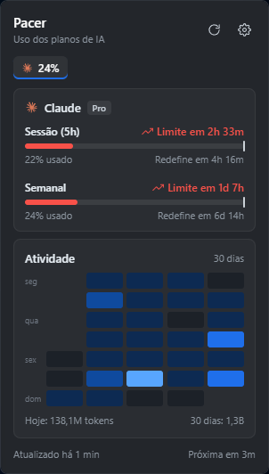
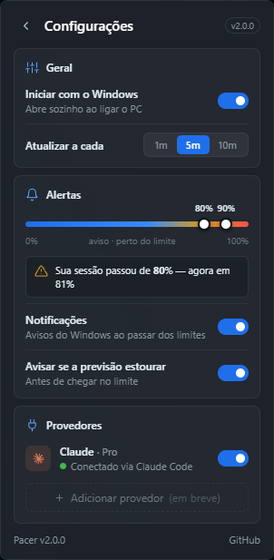

# Pacer

**English** · [Português](README.md)

> **Note:** the app's interface is in Brazilian Portuguese.

A Windows widget that shows how much of your AI plan you've already used — and
**where your current pace will take you** before the limit resets.



## What it shows

- Claude's **5-hour session and weekly** usage, with the real percentage from
  Anthropic
- **Pace projection**: the white mark on each bar shows where you'll be when
  the window resets; if you're going to run out, it says "Limite em 1d 7h"
  ("limit in 1d 7h")
- **Last 30 days of activity** in a GitHub-style grid, built from Claude Code's
  local logs
- Windows **notifications** when you cross each threshold (80% and 95% by
  default) and when the projection says you'll hit the limit before the reset
- A tray icon whose color follows your usage



## Requirements

- Windows 10/11
- [Claude Code](https://claude.com/claude-code) installed and logged in — the
  login and the logs come from it

## Install

Download the installer from [Releases](https://github.com/sthevan027/Claude-Glass/releases)
and run it. The executable is signed with an internal (Virex) certificate, so
Windows may show "Windows protected your PC" → **More info → Run anyway**.

### Run from source

Requires Rust, Bun and Visual Studio Build Tools (C++).

```bash
bun install
bun run tauri dev     # development
bun run tauri build   # installer in src-tauri/target/release/bundle/nsis/
```

Tests: `cargo test --manifest-path src-tauri/Cargo.toml` and `bun run test`.

## Privacy

- Pacer **reads** `~/.claude/.credentials.json` (Claude Code's login) and
  **never writes to it or refreshes the token** — Claude Code does that itself.
- The token never reaches the UI; it stays in the Rust process.
- It only talks to `api.anthropic.com`. No telemetry.
- Settings live in `%APPDATA%\dev.sthevan.pacer\config.json`.

## Credits

Style inspired by Fabio Akita's [ai-usagebar](https://github.com/akitaonrails/ai-usagebar)
(MIT), which is also where the Claude symbol used in the app comes from.

## License

MIT
