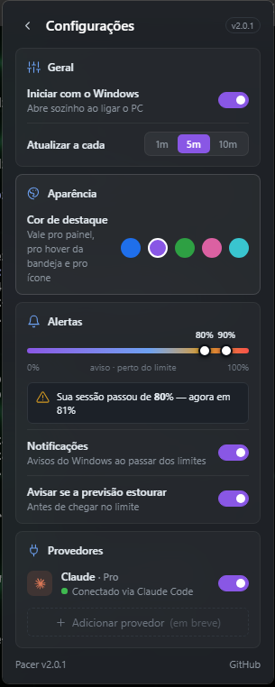
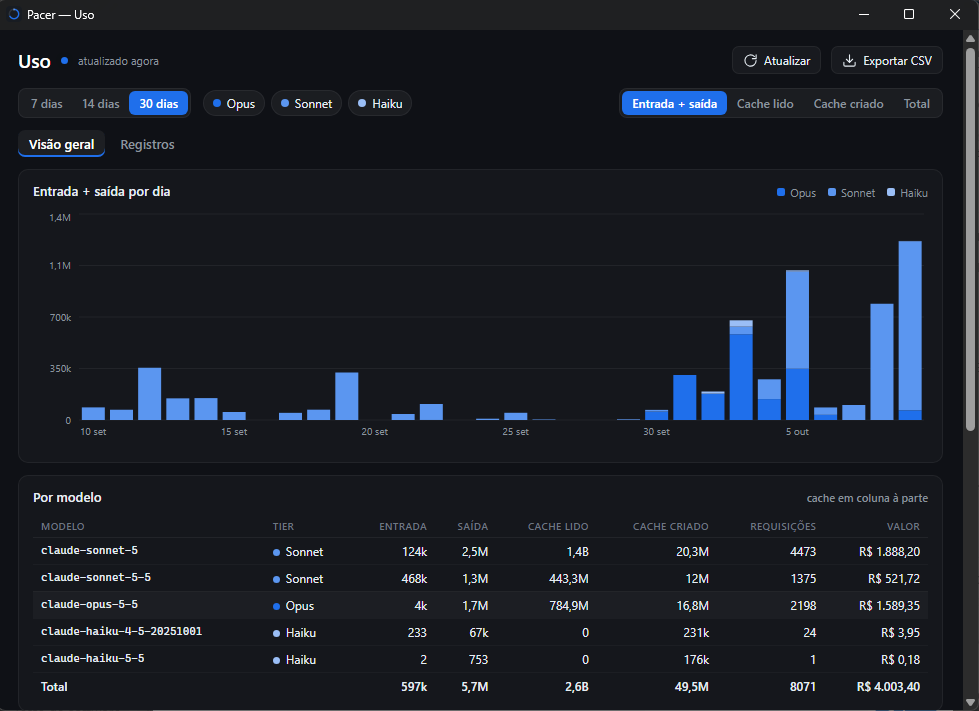
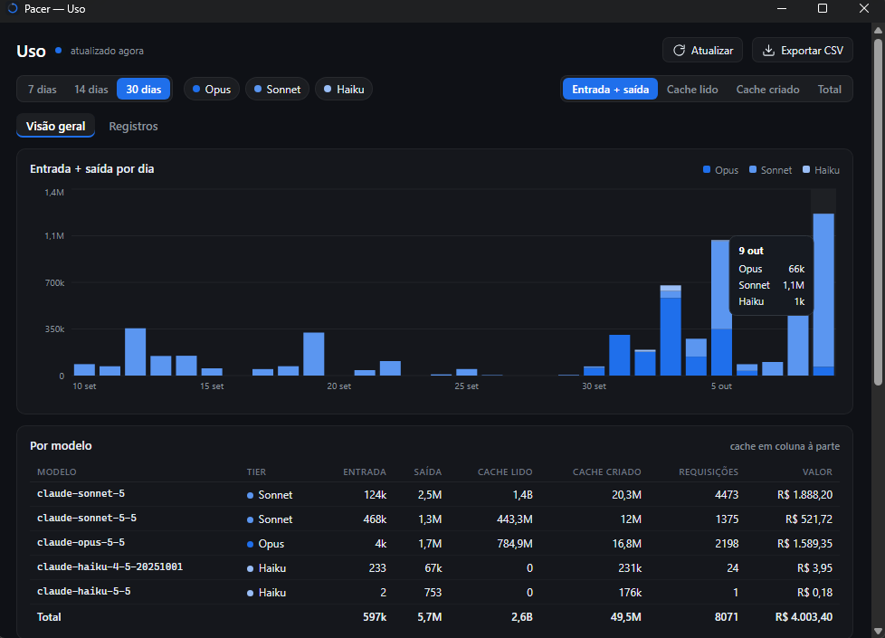

# Pacer

**Português** · [English](README.en.md)

Widget para Windows que mostra quanto do seu plano de IA você já usou — e
**para onde o ritmo atual te leva** antes da redefinição.


## O que mostra

- **Sessão (5h) e semanal** do Claude, com a % real vinda da Anthropic
- **Previsão do ritmo**: a marca branca na barra mostra onde você vai estar
  na redefinição; se for estourar, aparece "Nesse ritmo, acaba em 1d 7h"
- **Atividade dos últimos 30 dias** em grade estilo GitHub, a partir dos logs
  locais do Claude Code
- **Alertas** do Windows ao passar de cada limiar (padrão 80% e 95%) e quando
  a previsão indicar que o limite acaba antes da redefinição
- Ícone na bandeja que muda de cor conforme o uso, com popup visual ao passar
  o mouse (Sessão e Semanal, sem precisar abrir o painel)
- **Cor de destaque** configurável (5 presets) — vale pro painel, pro popup
  de hover e pro ícone, tudo junto. Aviso (laranja) e crítico (vermelho)
  continuam fixos, pra não perder o sinal de alerta




## Painel de uso

Clique no ícone de gráfico no cabeçalho do widget (ou em **Abrir painel de uso**,
no menu da bandeja) para abrir uma janela à parte com o consumo detalhado. É uma
janela normal, que nasce só quando você abre e é destruída ao fechar — o widget
continua leve.

- **Por dia e por tier**: gráfico empilhado de Opus/Sonnet/Haiku, com filtro de
  período (7/14/30 dias) e de tier. A métrica do gráfico é escolhível, porque
  cache lido costuma ser ordens de grandeza maior que entrada + saída
- **Por modelo**: entrada, saída, cache lido e cache criado separados — o cache
  **não** entra somado ao consumo, que era o que inflava o número
- **Rankings**: quais sessões e quais projetos mais consumiram
- **Registros**: as 200 requisições mais recentes, e **Exportar CSV** (gravado
  em Downloads) com as mesmas colunas
- **Valor estimado** a preço de API, em R$, usando a tabela oficial de preços e
  a cotação que você define nas Configurações. Quem usa assinatura não paga
  isso — é uma referência, não uma fatura. Modelo fora da tabela fica **sem**
  valor, e o painel avisa, em vez de chutar um número




> O valor por modelo e por requisição é uma **estimativa a preço de API**
> (tabela de preços lida em 10/10/2026). A cotação do dólar é editável em
> Configurações → Valor estimado.

## Requisitos

- Windows 10/11
- [Claude Code](https://claude.com/claude-code) instalado e logado — é de onde
  vêm o login e os logs

## Instalação

Baixe o instalador em [Releases](https://github.com/sthevan027/pacer/releases)
e execute. A partir da 2.0.1 o instalador é **assinado com o certificado Sthevan.Dev**
(autoassinado, não é de uma autoridade comercial). Por isso o Windows ainda pode mostrar
"Windows protegeu o computador" → **Mais informações → Executar assim mesmo**.
Para o Windows reconhecer a assinatura, instale uma vez como confiável o
`Sthevan.Dev-Root-CA.cer` publicado junto da release (opcional).

### Rodar do código

Requer Rust, Bun e o Visual Studio Build Tools (C++).

```bash
bun install
bun run tauri dev     # desenvolvimento
bun run tauri build   # instalador em src-tauri/target/release/bundle/nsis/
```

Testes: `cargo test --manifest-path src-tauri/Cargo.toml` e `bun run test`.

## Privacidade

- O Pacer **lê** `~/.claude/.credentials.json` (o login do Claude Code) e
  **nunca escreve nele nem renova o token** — quem renova é o próprio Claude Code.
- O token nunca chega na interface; fica só no processo Rust.
- Só conversa com `api.anthropic.com`. Sem telemetria.
- Configuração em `%APPDATA%\dev.sthevan.pacer\config.json`.
- O painel lê os logs locais do Claude Code e por isso mostra **nomes de
  pasta de projeto e identificadores de sessão**. Isso fica só na sua máquina,
  mas atenção: o **CSV exportado contém esses nomes** — não publique o arquivo
  sem olhar.

## Créditos

Estilo inspirado no [ai-usagebar](https://github.com/akitaonrails/ai-usagebar)
de Fabio Akita (MIT), de onde vem também o símbolo do Claude usado no app.

## Licença

MIT
